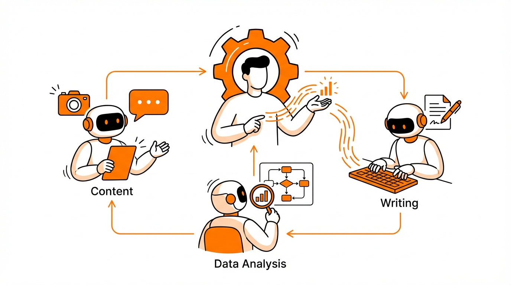
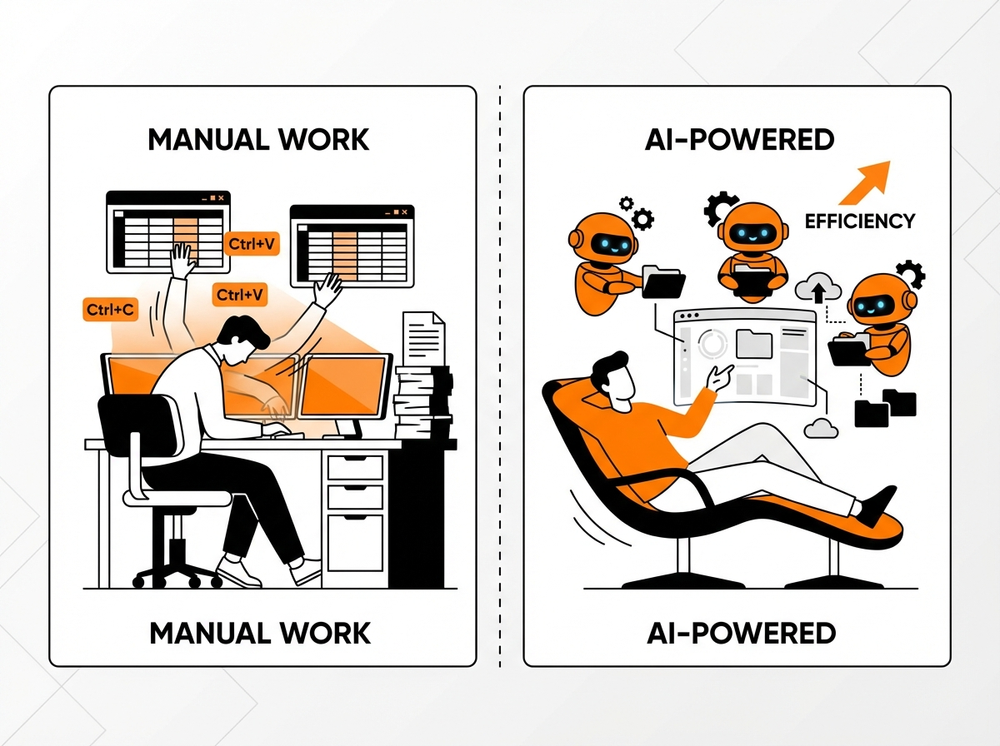

# AI 오케스트레이션 구축 가이드: 혼자서 AI 에이전트 연합 만드는 3단계



"직원 한 명 없이 여러 사업을 운영한다고요?"

"네, 저는 AI 에이전트 연합이 있거든요."

이 대화가 더 이상 농담이 아닌 시대가 왔습니다.

ChatGPT에 복사해서 붙여넣고, 다른 AI에 또 복사해서 붙여넣고... 이런 방식으로 AI를 쓰고 계신가요? 사실 저도 그랬습니다. AI 도구가 늘어날수록 오히려 일이 늘어나는 느낌이었죠.

그런데 2026년, AI를 쓰는 방식이 완전히 달라지고 있습니다. AI들이 서로 협업하는 시스템, 이른바 **AI 오케스트레이션**이 가능해진 겁니다.

오늘은 혼자서 AI 에이전트 연합을 만드는 방법을 알려드리겠습니다. 어렵지 않습니다. 3단계만 따라하면 됩니다.

---

## AI 에이전트와 오케스트레이션, 이게 뭔가요?

먼저 용어부터 정리하고 가겠습니다.

### AI 에이전트란?

쉽게 말해, **'특정 업무만 전문으로 하는 AI 담당자'**입니다.

우리가 쓰는 ChatGPT나 Claude는 '만능 비서' 같습니다. 뭘 시키든 다 하려고 하죠. 반면 AI 에이전트는 '전문 담당자'입니다.

- 콘텐츠 기획만 담당하는 AI
- 데이터 분석만 담당하는 AI
- SNS 글쓰기만 담당하는 AI

각자 맡은 일만 집중해서 합니다.

### 서브에이전트(Subagent)란?

회사에서 팀장이 팀원들에게 일을 분배하듯이, 메인 AI가 전문 AI 담당자들에게 일을 나눠주는 구조입니다. 이 전문 AI 담당자들을 '서브에이전트'라고 부릅니다.

예를 들어볼게요:

> **사용자**: "이 주제로 블로그 글 써줘"
>
> **메인 AI (팀장 역할)**: "알겠어, 일을 나눌게"
>
> - 리서치 담당에게: "자료 조사해줘"
> - 글쓰기 담당에게: "본문 작성해줘"
> - SEO 담당에게: "검색 최적화해줘"

각 담당자가 자기 일을 끝내면 다음 담당자에게 넘깁니다. 사용자는 최종 결과만 받으면 됩니다.

### AI 오케스트레이션이란?

오케스트라에서 지휘자가 각 파트를 조율하듯이, **여러 AI 에이전트들이 협업하도록 조율하는 것**을 AI 오케스트레이션이라고 합니다.

정리하면 이렇습니다:

- **AI 에이전트** = 전문 담당자
- **서브에이전트** = 팀장 아래 일하는 전문 담당자들
- **AI 오케스트레이션** = 이들이 협업하는 전체 시스템

비유하자면, 1인 식당 vs 분업화된 레스토랑 주방의 차이입니다.

### Claude Code: 비개발자도 쓸 수 있는 AI 오케스트레이션 도구

이런 AI 오케스트레이션을 가능하게 해주는 대표적인 도구가 **Claude Code**입니다.

Anthropic에서 만든 Claude Code는 여러 AI 에이전트(서브에이전트)를 정의하고, 이들이 협업하도록 조율하는 **오케스트레이션 기능**을 제공합니다.

특이한 점은, 코딩 지식 없이도 사용할 수 있다는 것입니다. 에이전트를 정의하는 파일이 마크다운(텍스트) 형식이라, 프로그래밍을 몰라도 "이 담당자는 이런 일을 해" 라고 적으면 됩니다.

이런 접근성 덕분에 **Claude Code는 최근 비개발자 1인 사업자, 콘텐츠 크리에이터 사이에서 크게 주목받고 있습니다**. 개발자 전용 도구였던 AI 자동화가, 이제 마케터, 작가, 컨설턴트도 활용할 수 있게 된 거죠.

---

## 2026년, 왜 지금 AI 오케스트레이션인가

"그런 거 예전에도 있지 않았나요?"

맞습니다. 하지만 2026년이 다른 이유가 있습니다.

예전에는 AI들끼리 대화가 안 됐습니다. 마치 각자 다른 언어를 쓰는 직원들처럼요. 결국 사람이 중간에서 통역(복사/붙여넣기)을 해야 했죠.

지금은 AI들이 **같은 '공간'에서 일할 수 있게 됐습니다**. 같은 파일을 보고, 서로 결과를 넘기고, 필요하면 질문도 합니다.

숫자로 보면 더 명확합니다:

| 지표                              | 수치                                         |
| --------------------------------- | -------------------------------------------- |
| 멀티에이전트 시스템 문의 증가     | **1,445%** (Gartner, 2024 Q1→2025 Q2) |
| 2026년 기업 앱 AI 에이전트 탑재율 | **40%** (2025년 5%에서 급증)           |

더 이상 실험실 이야기가 아닙니다.

> "2026년은 이러한 패턴들이 실험실에서 현실로 나오는 해입니다."
> — Kate Blair, IBM

Anthropic(Claude 개발사)의 CEO Dario Amodei는 더 과감하게 예측합니다:

> "AI가 곧 한 개인이 10억 달러 기업을 운영할 수 있게 할 것이다."

---

## AI 오케스트레이션 vs 개별 AI 도구, 뭐가 다른가

지금 쓰는 방식과 뭐가 다른지, 시나리오로 비교해볼게요.

### 기존 방식: 내가 조율자

1. ChatGPT에게 "자료 조사해줘" → 결과 복사
2. Claude에게 "이 자료로 글 써줘" (붙여넣기) → 결과 복사
3. 다른 도구에게 "SEO 최적화해줘" (붙여넣기)

→ 내가 계속 중간에서 전달해야 합니다.

### AI 오케스트레이션 방식: AI가 팀장

1. "이 주제로 블로그 글 써줘"
2. AI 팀장이 알아서 분배
3. 최종 결과물만 받음

→ 나는 방향만 정해주면 됩니다.



표로 정리하면 이렇습니다:

| 구분        | 개별 AI 도구       | AI 오케스트레이션 |
| ----------- | ------------------ | ----------------- |
| 내 역할     | 조율자 (복붙 담당) | 의사결정자        |
| 설명 방식   | 매번 처음부터      | 한 번만 설정      |
| 결과물 전달 | 수동 복사/붙여넣기 | 자동 핸드오프     |
| AI 추가 시  | 내 일도 증가       | 시스템이 처리     |

핵심은 이겁니다:

> **기존에는 내가 '조율자'였다면, AI 오케스트레이션에서는 AI가 '팀장'이 됩니다. 나는 '사장님'처럼 방향만 정해주면 됩니다.**

---

## AI 오케스트레이션 설계하기: 3단계 구조화 프로세스

"그래서 어떻게 만드는 건데요?"

좋은 질문입니다. 3단계 대화만 따라하면 됩니다. AI에게 질문을 던지면, AI가 알아서 구조를 잡아줍니다.

### 1단계: "내가 뭘 하고 싶은지" 정리하기

첫 번째는 자동화할 업무를 구체화하는 단계입니다.

이런 프롬프트를 AI에게 주세요:

```
나는 [목적]을 위한 AI 에이전트 연합을 만들려고 해.
내가 하려는 작업을 설명할 테니, 너는 다음 질문들로 구체화해줘:
- 이 작업의 최종 결과물은 뭐야?
- 어떤 재료(입력)가 필요하고, 뭐가 나와야 해?
- 반복되는 패턴이나 분기점이 있어?
- 내가 직접 판단해야 하는 부분은 어디야?
```

이 대화를 마치면 **작업 정의서**가 나옵니다. 우리 에이전트 연합이 뭘 할지 명확해지죠.

### 2단계: "누가 뭘 할지" 나누기

두 번째는 담당자별 역할을 분배하는 단계입니다.

```
이제 이 작업을 담당자별로 나눠보자.
각 담당자마다:
- 언제 일을 시작하는지 (트리거)
- 뭐가 필요하고 뭘 만드는지
- 판단이 필요하면 기준이 뭔지
- 결과물 형태
를 정리해줘.
```

결과물은 **역할 분담표**입니다. 누가 언제 뭘 하는지 명확해집니다.

### 3단계: "실제로 세팅하기"

마지막은 구체적인 설정 파일을 생성하는 단계입니다.

```
이제 이 역할 분담을 기반으로 실제 구조를 만들어줘:
- 전체 팀 안내서 (claude.md)
- 각 담당자 설명서
- 폴더 구조
```

이 대화를 마치면 **실제 구현 파일들**이 나옵니다. 바로 사용할 수 있죠.

---

## 바로 쓸 수 있는 프롬프트 템플릿

3단계를 한 번에 시작할 수 있는 종합 템플릿입니다. 복사해서 바로 사용하세요.

```
나는 [작업명]을 자동화하는 AI 에이전트 연합을 만들려고 해.

**내가 하려는 일**
- 목적:
- 필요한 재료(입력):
- 원하는 결과물:
- 주의사항:

**내가 받고 싶은 것**
1. 작업 정리 문서 (배경, 목적, 범위)
2. 역할 분담표 (단계, 담당자, 순서)
3. 실제 설정 파일들

**진행 방식**
먼저 나에게 이 작업을 구체화하기 위한 질문을 해줘.
내 답변을 바탕으로 위 결과물들을 순서대로 만들어가자.
```

이 템플릿을 복사해서 Claude에게 주세요. AI가 질문을 통해 여러분의 업무를 구체화하고, 3단계 결과물을 순서대로 만들어줍니다.

처음엔 간단한 업무 하나로 시작해보세요.

---

## 실제로 가능해? 30분 만에 5명의 AI 담당자

"정말 되나요?"

실제 사례를 보여드리겠습니다.

### Grace Leung 사례

유튜버 Grace Leung은 **30분 만에 5명의 AI 담당자 연합**을 만들었습니다:

- 콘텐츠 기획 담당
- 프레젠테이션 담당
- 데이터 분석 담당
- SNS 담당
- SEO 담당

> "30분이면 다 할 수 있어요."
> — Grace Leung

👉 [Grace Leung의 전체 과정 보기 (YouTube)](https://youtu.be/0J2_YGuNrDo)

### Alex McFarland 사례

글쓰기 전문가 Alex McFarland는 이렇게 말합니다:

> "직원 한 명 없어요. 여러 클라이언트의 글쓰기 업무를 전부 AI 에이전트 연합으로 처리합니다."

👉 [Alex McFarland의 글쓰기 자동화 과정 보기 (YouTube)](https://www.youtube.com/watch?v=0hgyHOLIFxw)

### 구체적인 성과 수치

| 지표                    | 결과                     |
| ----------------------- | ------------------------ |
| 인간-AI 협업 생산성     | **60% 더 높음**    |
| 콘텐츠 제작 속도        | **46% 빨라짐**     |
| 자동화로 확보 가능 시간 | **주 20시간 이상** |

글쓰기 담당자, 데이터 분석가, SNS 담당자... 이 모든 역할을 AI 에이전트 연합에게 맡길 수 있습니다. 30분이면 시작할 수 있습니다.

---

## 실패하지 않으려면: 체크리스트

하지만 주의할 점이 있습니다.

Gartner에 따르면, **2027년까지 AI 에이전트 프로젝트의 40%가 중단될 것**이라고 합니다.

가장 큰 원인은 뭘까요?

> "담당자만 많이 만들고, 협업 규칙을 안 정해서"입니다.

마치 신입 5명을 뽑아놓고 업무 분장표 없이 "알아서 해봐"라고 하는 것과 같습니다.

### 성공 체크리스트

셋팅하기 전에 이것만 확인하세요:

- [ ] **역할 겹침 체크**: 두 담당자가 같은 일을 하려 하지 않나?
- [ ] **시작 조건 명확화**: 각 담당자가 언제 일을 시작하는지 정했나?
- [ ] **순서 정의**: A가 끝나야 B가 시작하는 경우, 순서를 정했나?
- [ ] **참고자료 제공**: 담당자가 참고할 템플릿, 예시를 줬나?
- [ ] **협업 규칙 문서화**: 전체 규칙이 한 곳에 정리되어 있나?

핵심 조언은 이겁니다:

> **AI 담당자를 많이 만드는 게 중요한 게 아닙니다. 역할을 명확하게 정의하고, 협업 규칙을 세우는 게 핵심입니다.**

---

## 마치며

정리하면 이렇습니다:

1. **AI 에이전트 = 전문 담당자**, 서브에이전트들이 모이면 AI 에이전트 연합
2. **2026년은 AI 오케스트레이션의 해** — 혼자서도 협업 시스템을 가질 수 있다
3. **3단계 프로세스**: 작업 정의 → 역할 분담 → 실제 세팅
4. 핵심은 **'많이 만드는 것'이 아니라 '협업 규칙을 잘 세우는 것'**

---

오늘 알려드린 프롬프트 템플릿, 바로 사용해보세요.

작게 시작해도 괜찮습니다. "내가 매주 반복하는 업무 하나"를 먼저 떠올려보세요.

- 주간 보고서 작성?
- 뉴스레터 발행?
- SNS 콘텐츠 만들기?

그 업무 하나로 3단계 프로세스를 따라가 보세요. 처음엔 30분이면 충분합니다.

**여러분도 AI 에이전트 연합을 가질 수 있습니다.**

---

## 참고 자료

- [Gartner - AI Agent Trends 2026](https://www.gartner.com)
- [Google Cloud AI Agent Trends 2026](https://cloud.google.com/resources/content/ai-agent-trends-2026)
- [Grace Leung - Claude Code just Built me an AI Agent Team](https://youtu.be/0J2_YGuNrDo)
- [Alex McFarland - Claude Code for Writers](https://www.youtube.com/watch?v=0hgyHOLIFxw)
- [Anthropic - Claude Code Subagents](https://code.claude.com/docs/en/sub-agents)
