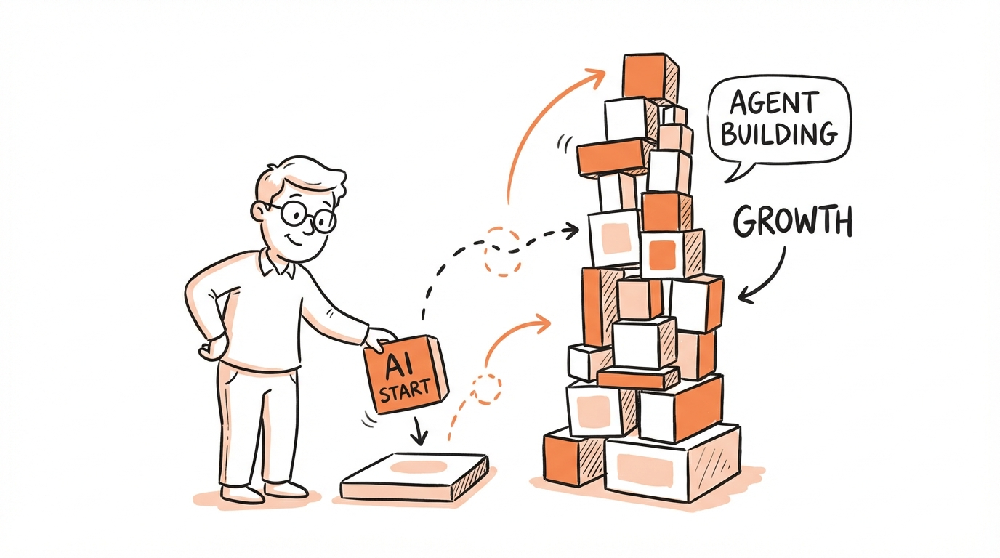
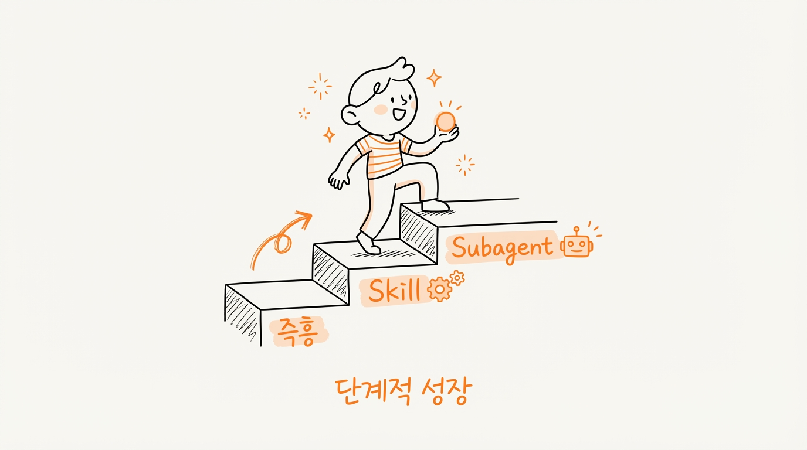
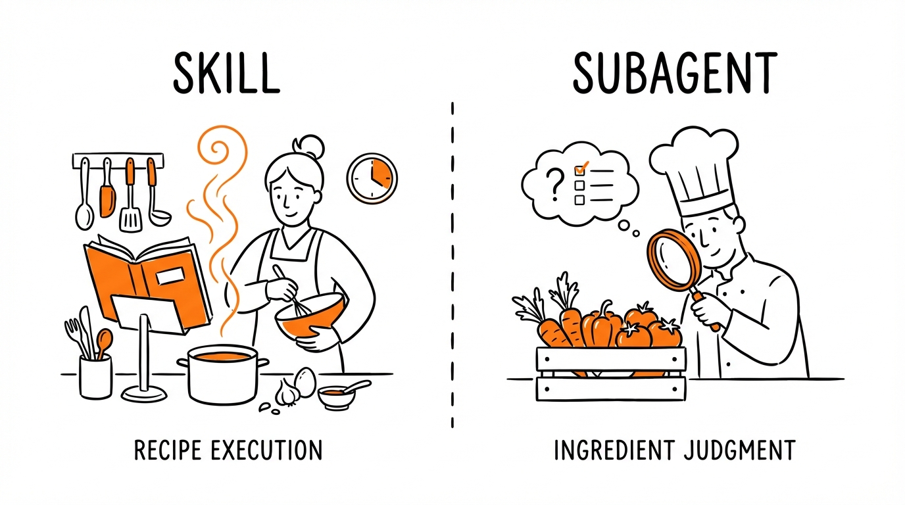

# AI 에이전트 만들기: 비개발자도 시작할 수 있는 3단계 확장 전략



"AI 에이전트 만들어보고 싶은데, 뭔가 거창해 보여서 엄두가 안 나요."

이런 생각 해보신 적 있으신가요? 아니면 일단 만들어는 봤는데, "이게 맞는 건지 모르겠다"며 불안해하고 계신가요?

저도 처음엔 그랬습니다. Skill이니 Subagent니 하는 용어들이 복잡해 보였고, 뭔가 제대로 된 구조를 갖춰야 할 것 같은 압박감이 있었어요. 그런데 직접 써보면서 깨달은 게 있습니다.

**처음부터 완벽한 구조를 만들려고 하면, 시작조차 못합니다.**

SaaStr CEO Jason Lemkin이 한 말이 인상적이었어요.

> **“도구든 에이전트든, 에이전틱 툴이든 하나 골라서 실제 문제 하나를 해결해 봐라. 그걸 할 수 있으면, 취업 시장에서 굉장히 경쟁력이 있다.”** "Pick a tool, an agent, an agentic tool to solve one of your problems. If you can go do this, you're hyper employable."

**내 문제 하나를 해결하는 에이전트를 직접 만들어보면, 그것만으로도 희소한 역량이 된다**는 거죠. 대부분의 사람들이 "에이전시에 맡기자" 또는 "벤더가 알아서 해주겠지"라고 생각하지, 직접 해보지는 않거든요.

오늘은 제가 직접 경험하면서 정리한 "단계적 확장 전략"을 공유해드릴게요. 핵심은 간단합니다. **일단 돌아가게 만들고, 그 다음에 개선하면 됩니다.**

---

## AI 에이전트 만들기, 어디서 시작할까?

막상 시작하려니 "뭘 자동화해야 하지?" 싶으시죠? 시작하기 좋은 영역이 있습니다.

### 추천하는 첫 번째 영역

| 영역                           | 왜 좋은가                           | 예시                      |
| ------------------------------ | ----------------------------------- | ------------------------- |
| **반복적인 질문 응대**   | 패턴이 명확하고, 즉각적인 효과 체감 | 고객 문의, 팀원 질문 대응 |
| **정보 정리/요약**       | 입력→출력 구조가 단순              | 회의록 요약, 문서 정리    |
| **템플릿 기반 작성**     | 포맷이 정해져 있어 품질 관리 쉬움   | 이메일 초안, 보고서 양식  |
| **방치된 업무 재활성화** | 아무도 안 하던 거라 리스크 낮음     | 미처리 리드, 오래된 문의  |

핵심은 **"가장 고통스러운 반복 업무 하나"**를 고르는 거예요. 매일 30분씩 잡아먹는 그 작업, 있잖아요. 거기서 시작하세요.

### 흔한 실패 원인

시작 전에 피해야 할 함정들이 있습니다.

- **"Turn on with zero work"**: 도구 사서 그냥 켜두고 기대하는 것. 성공률 0%입니다.
- **에이전시에 위임**: 에이전시도 아직 이 영역 전문성이 부족해요. 내가 직접 해봐야 합니다.
- **한 번 설정하고 방치**: 에이전트는 지속적인 확인과 개선이 필요합니다.

> "Turning it on with zero work is a F. It's just no chance." — Jason Lemkin

---

## AI 에이전트 3단계 확장 전략: 즉흥 실행 → Skill → Subagent



처음부터 완벽한 구조를 만들 필요 없어요. 단계적으로 확장하는 게 훨씬 현실적입니다.

| 단계  | 형태                | 언제 사용하나                     |
| ----- | ------------------- | --------------------------------- |
| 1단계 | **즉흥 실행** | 프롬프트로 바로 실행, 일회성 작업 |
| 2단계 | **Skill**     | 반복 사용할 패턴을 정형화         |
| 3단계 | **Subagent**  | 자율 판단이 필요한 복잡한 역할    |

### 언제 다음 단계로 올릴까?

승격 기준은 생각보다 단순합니다.

**즉흥 실행 → Skill로 올릴 때:**

- 같은 작업을 **3번 이상 반복**하게 될 때
- "이거 매번 설명하기 귀찮다" 싶을 때
- 특정 스타일이나 포맷을 일관되게 유지하고 싶을 때

**Skill → Subagent로 올릴 때:**

- Skill 안에서 **여러 판단이 필요**할 때
- "상황에 따라 다르게 처리해야 해"가 많아질 때
- 하나의 Skill이 너무 길어져서 관리가 어려울 때

예를 들어볼게요. "블로그 SEO 최적화"는 절차가 정해져 있으니 Skill로 충분합니다. 하지만 "콘텐츠를 요약한 다음 개인화된 질문 생성"처럼 상황 판단이 필요한 작업은 Subagent가 적합하죠.

---

## Skill vs Subagent, 뭘 선택해야 할까?

둘 다 "재사용 가능한 자동화"인데, 정확히 뭐가 다를까요?

### 핵심 판단 기준: 의사결정 트리를 그릴 수 있는가?

Anthropic의 Barry Zhang은 에이전트 구축 전 가장 먼저 물어봐야 할 질문을 이렇게 정리했습니다.

> **"의사결정 트리를 쉽게 그릴 수 있다면, 그냥 그걸 명시적으로 구축하고 각 노드를 최적화하세요. 훨씬 비용 효율적이고 제어하기도 쉽습니다."**

이걸 Skill과 Subagent 선택에 적용하면 이렇습니다.

| 질문 | 답변 | 선택 |
|------|------|------|
| 이 작업의 흐름을 플로우차트로 그릴 수 있나? | Yes → A하면 B, B하면 C... | **Skill** (워크플로우) |
| 중간에 "상황 봐서" 판단해야 하는 부분이 많나? | Yes → 경우의 수가 너무 많음 | **Subagent** (에이전트) |

**예시로 비교해보면:**

- **"블로그 SEO 최적화"**: 키워드 분석 → 메타 태그 작성 → 가독성 점검 → 완료. 흐름이 명확하니 **Skill**
- **"고객 문의에 맞춤 응답"**: 문의 유형 파악 → 맥락 이해 → 톤 조절 → 추가 정보 필요 여부 판단... 분기가 많으니 **Subagent**

### 4가지 체크 질문

의사결정 트리 기준과 함께, 헷갈릴 때는 이 4가지 질문도 던져보세요.

| 질문                          | Yes면    | No면     |
| ----------------------------- | -------- | -------- |
| 절차가 고정되어 있나?         | Skill    | Subagent |
| 중간에 판단/분기가 많나?      | Subagent | Skill    |
| 한 번에 끝나나?               | Skill    | Subagent |
| 전문가처럼 "역할"이 필요한가? | Subagent | Skill    |

쉽게 비유하자면 이렇습니다.



- **Skill**: 레시피대로 따라하면 되는 요리
- **Subagent**: 재료를 보고 뭘 만들지 판단하는 셰프

레시피가 있으면 누구나 따라할 수 있지만, 셰프는 상황을 보고 결정을 내리죠. 여러분의 작업이 레시피에 가까운지, 셰프의 판단이 필요한지 생각해보세요.

---

## AI가 만들어준 설계, 그냥 믿어도 될까?

기획서를 주고 "Skill과 Subagent 구성해줘"라고 하면 Claude가 알아서 만들어줍니다. 그런데 이걸 그냥 믿고 써도 될까요?

**결론부터 말씀드리면, 일단 써보세요. 그리고 "신호"가 오면 조정하면 됩니다.**

처음부터 완벽한 설계는 없어요. 실제로 사용해보면서 아래 신호가 나타나면 그때 조정하면 됩니다.

### 합쳐야 할 때 (3가지 신호)

| 신호                                     | 예시                                    |
| ---------------------------------------- | --------------------------------------- |
| 비슷한 작업인데 매번 다른 Skill이 호출됨 | "요약 생성"과 "핵심 추출"이 번갈아 호출 |
| A 실행 후 항상 B가 따라옴                | 자막 추출하면 항상 요약이 뒤따름        |
| 이름이 비슷해서 Claude가 헷갈려함        | content-writer vs content-creator       |

### 나눠야 할 때 (3가지 신호)

| 신호                                 | 예시                                       |
| ------------------------------------ | ------------------------------------------ |
| 실행 시간이 너무 길다                | 하나의 Skill이 5분 이상 걸림               |
| 일부분만 재사용하고 싶다             | 전체 워크플로우 중 "요약"만 따로 쓰고 싶음 |
| 한 Skill 안에서 역할이 완전히 다르다 | 분석도 하고, 글도 쓰고, 검증도 함          |

이런 신호가 보이면 그때 구조를 조정하면 됩니다. 미리 고민하느라 시작을 미루지 마세요.

---

## AI 에이전트 운영 사이클: 실행 → 관찰 → 조정 → 반복

완벽한 설계를 고민하느라 시작을 미루는 건 가장 피해야 할 패턴입니다. 대신 이 사이클을 반복하세요. 자연스럽게 좋은 구조가 만들어집니다.

### 에이전트 훈련의 3단계

에이전트를 만드는 건 "설정하고 끝"이 아닙니다. **Ingestion → Training → QA** 과정을 거쳐야 해요.

| 단계                   | 할 일                                            | 시간 투자       |
| ---------------------- | ------------------------------------------------ | --------------- |
| **1. Ingestion** | 에이전트에게 맥락 제공 (문서, URL, FAQ 업로드)   | 초기 1-2시간    |
| **2. Training**  | 답변 검토하고 피드백 주기, 질문 던지고 품질 확인 | 매일 30분~1시간 |
| **3. QA**        | 출력물 검토, 오류 수정, 이상 패턴 모니터링       | 지속적          |

> "If you do this for 30 days and every day spend hours training it... it actually will get pretty good." — Jason Lemkin

핵심은 **매일 반복**하는 거예요. 한 번 설정하고 방치하면 안 됩니다. 30일 정도 꾸준히 훈련하면 꽤 쓸만해집니다.

### 구조 개선 사이클

훈련과 별개로, 구조 자체도 계속 개선해야 합니다.

```
1. 실행: 일단 Claude가 만들어준 대로 사용
   ↓
2. 관찰: 사용하면서 불편함/신호 감지
   ↓
3. 조정: 합치거나 나누기
   ↓
4. 반복: 다시 사용하며 관찰
```

### 핵심 마인드셋

| ❌ 하지 말 것                      | ✅ 할 것                    |
| ---------------------------------- | --------------------------- |
| 처음부터 완벽한 구조 설계하려 함   | 일단 돌아가게 만들고 개선   |
| "이게 맞나?" 고민만 하며 시작 못함 | 써보고 불편하면 그때 고치기 |
| 한 번 설정하고 방치                | 매일 조금씩 훈련하고 개선   |

처음엔 Claude 설계를 그대로 쓰더라도 괜찮아요. 위 사이클을 몇 번 돌리다 보면 "아, 이건 합쳐야겠다" 감이 옵니다. "이건 너무 뭉쳐있네" 느낌도 오고요. 결국 **자기만의 기준**이 생깁니다.

---

## 마치며

오늘 내용을 정리하면 이렇습니다.

1. **어디서 시작할까?** 가장 고통스러운 반복 업무 하나를 고르세요.
2. **어떻게 확장할까?** 즉흥 실행 → Skill → Subagent 순서로 단계적으로.
3. **어떻게 훈련할까?** Ingestion → Training → QA 사이클을 매일 반복.
4. **언제 구조를 바꿀까?** 신호가 오면 그때 조정하면 됩니다.

> "설계 능력은 이론으로 배우는 게 아니라, 직접 조정해보면서 체득하는 것입니다."

### 이번 주 해볼 것

1. **반복 업무 하나 선택**: 매일 30분 이상 잡아먹는 그 작업
2. **프롬프트 하나로 시도**: 완벽하지 않아도 됨
3. **30일 훈련 계획**: 매일 30분씩 피드백 주기

첫 번째 에이전트를 만들면, **두 번째는 훨씬 쉬워집니다**. 그리고 그 경험 자체가 희소한 역량이 됩니다.

> "The second one will be easier. And then you'll be ahead instead of waiting for an agency to do it." — Jason Lemkin

완벽하지 않아도 괜찮습니다. 직접 해보는 사람이 거의 없기 때문에, 해본 것만으로도 앞서가는 겁니다.

---

*AI 에이전트, 어렵게 생각하지 마세요. 작게 시작하고, 매일 조금씩 훈련하면 됩니다.*
