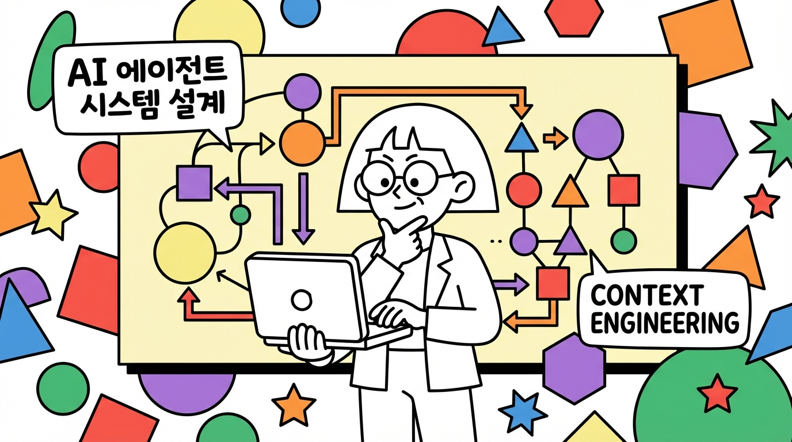
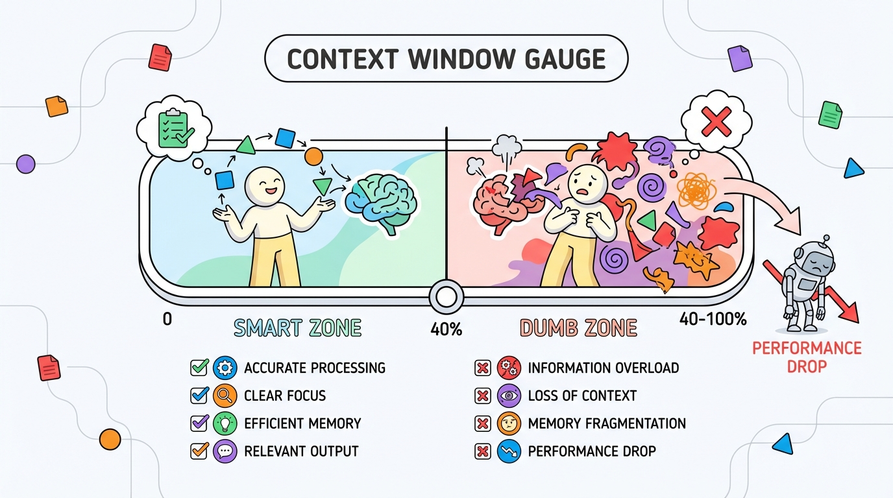
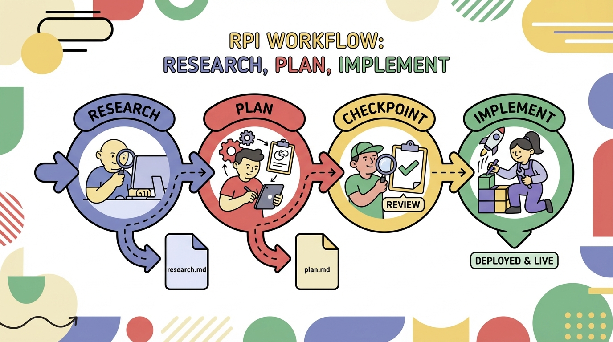
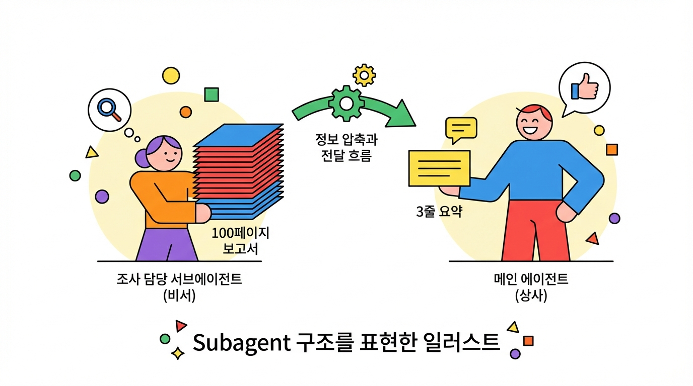

# AI 에이전트 설계의 핵심: 컨텍스트 엔지니어링 3가지 원칙



자동화 워크플로우, 커스텀 GPT, 내 업무에 딱 맞는 AI 에이전트.

요즘 이런 **AI 에이전트 시스템**을 직접 만들어보려는 분들이 늘고 있습니다. 그런데 막상 만들어보면 결과가 들쭉날쭉합니다. 프롬프트만 잘 쓰면 될 줄 알았는데 말이죠.

사실 AI 에이전트를 설계할 때 필요한 건 '프롬프트 엔지니어링'이 아닙니다. **'컨텍스트 엔지니어링(Context Engineering)'**입니다.

AI 전문가들이 말하는 핵심은 이겁니다: **"뭘 물어볼까"보다 "뭘 알려줄까"가 더 중요하다.**

오늘은 AI 에이전트 시스템을 설계할 때 알아야 할 컨텍스트 엔지니어링의 3가지 핵심 원칙을 알려드리겠습니다.

| 원칙                | 핵심 질문      |
| ------------------- | -------------- |
| Context Engineering | 무엇을 줄까?   |
| RPI 워크플로우      | 언제 줄까?     |
| Subagent 활용       | 어떻게 나눌까? |

---

## 1. 컨텍스트 엔지니어링의 핵심: 무엇을 줄까?



AI 에이전트가 이상한 결과를 내면 보통 이렇게 생각합니다. "프롬프트를 잘못 썼나?" 하지만 진짜 원인은 다른 데 있을 수 있습니다.

HumanLayer의 Dex Horthy는 이렇게 말합니다:

> "AI는 생각을 대체할 수 없다. 당신이 한 생각(또는 하지 않은 생각)을 증폭할 뿐이다."

쉽게 말해서, **좋은 정보를 넣어야 좋은 결과가 나온다**는 겁니다. AI 에이전트를 설계할 때도 마찬가지입니다. 에이전트에게 어떤 컨텍스트를 제공하느냐가 결과물의 품질을 결정합니다.

### 컨텍스트 최적화의 4가지 축

AI 에이전트에게 제공하는 컨텍스트는 다음 4가지를 기준으로 점검하세요:

| 축                     | 질문                                               |
| ---------------------- | -------------------------------------------------- |
| **Correctness**  | 정확한 정보인가?                                   |
| **Completeness** | 필요한 정보가 다 있는가?                           |
| **Size**         | 적절한 양인가? (너무 많지 않은가?)                 |
| **Trajectory**   | 대화 흐름이 좋은가? (실패 패턴이 반복되지 않는가?) |

### 40% 규칙: 컨텍스트 윈도우의 한계

AI에게는 **'컨텍스트 윈도우'**라는 게 있습니다. AI가 한 번에 처리할 수 있는 정보의 양입니다.

연구에 따르면, **컨텍스트 윈도우의 40%를 넘어가면 성능이 저하**되기 시작합니다. 이걸 'Dumb Zone'이라고 부릅니다.

AI 에이전트 시스템을 설계할 때 이 점을 반드시 고려해야 합니다. 하나의 에이전트에 너무 많은 정보를 넣으면 성능이 떨어집니다.

**실천 포인트**: 에이전트가 처리해야 할 컨텍스트가 많다면, 여러 단계로 나누거나 여러 에이전트로 분리하세요.

---

## 2. AI 에이전트를 위한 RPI 워크플로우: 언제 줄까?



AI 에이전트 시스템을 설계할 때 가장 흔한 실수가 있습니다. 하나의 에이전트에 모든 걸 담으려는 것입니다.

"이 자료 분석하고, 요약하고, 보고서도 써줘."

이렇게 한 번에 시키면 편할 것 같지만, 결과물의 품질은 떨어집니다. 컨텍스트 윈도우가 빠르게 채워지고, 각 단계에서 생긴 작은 오류가 다음 단계로 전파되기 때문입니다.

대신 **RPI 워크플로우**를 적용하세요: **Research(조사) → Plan(계획) → Implement(실행)**

### 핵심 원칙: 중간 결과물을 파일로 저장하라

RPI 워크플로우의 핵심은 **각 단계의 결과물을 별도 파일로 저장**하는 것입니다.

왜 굳이 파일로 저장해야 할까요?

1. **컨텍스트 초기화**: 다음 단계의 에이전트는 파일만 읽고 시작합니다. 이전 단계의 시행착오가 다음 단계를 오염시키지 않습니다.
2. **검토 가능**: 파일로 저장하면 다음 단계로 넘어가기 전에 사람이 내용을 확인할 수 있습니다. Research 단계의 한 줄 오류가 전체 방향을 틀어지게 할 수 있으니까요.
3. **재사용 가능**: 잘 만든 research.md나 plan.md는 다른 프로젝트에서도 참고 자료로 활용할 수 있습니다.

### 에이전트 시스템 설계에 적용하기: 5단계

**Step 1. Research 지시**

```
"이 기능이 어떻게 작동하는지 분석하고,
관련 파일과 라인 넘버를 찾아 research.md로 정리해줘"
```

→ 출력: `research.md`

**Step 2. Research 결과 검토 (Human)**

- 조사 결과가 정확한지 사람이 직접 확인
- **중요**: 이 단계의 오류는 전체 방향을 틀어지게 합니다
- 잘못된 정보가 있으면 수정 요청 또는 재조사

**Step 3. Plan 지시**

```
"research.md를 기반으로 정확한 구현 단계를 plan.md로 작성해줘"
```

→ 출력: `plan.md`

**Step 4. Plan 검토 (Human)**

- 계획이 실행 가능한지, 빠진 단계가 없는지 확인
- **중요**: 계획의 한 줄 오류는 100줄의 나쁜 결과물로 이어집니다
- 필요시 피어 리뷰 진행

**Step 5. Implement 실행**

```
[새 컨텍스트에서]
"plan.md를 읽고 단계별로 실행해줘"
```

→ 출력: 최종 결과물

핵심은 **새 컨텍스트에서 시작**하는 것입니다. 이전 대화 내용 없이 plan.md 파일만 읽고 실행합니다.

### 왜 인간의 검토가 필수인가?

> "계획의 한 줄 오류는 100줄의 나쁜 코드로, Research의 한 줄 오류는 전체 방향 이탈로 이어진다."

AI는 자신의 오류를 스스로 발견하기 어렵습니다. 각 단계 사이에 사람이 개입해서 검토하는 것이 품질을 보장하는 유일한 방법입니다.

실제로 이 방법을 사용한 팀은 30만 줄 규모의 복잡한 프로젝트에서 7시간 만에 35,000줄의 코드를 성공적으로 배포했습니다.

---

## 3. AI 에이전트 Subagent 설계: 어떻게 나눌까?



AI 에이전트 시스템을 설계할 때 흔한 오해가 있습니다:

> "프론트엔드 담당 에이전트, 백엔드 담당 에이전트, QA 담당 에이전트로 나누면 좋겠지?"

**No.** 역할 기반 분리는 실질적 이점이 없습니다.

### Subagent의 진짜 목적: 컨텍스트 제어

Subagent를 나누는 진짜 목적은 **역할 분리**가 아니라 **컨텍스트 제어**입니다.

비유하자면 이렇습니다. 100페이지짜리 보고서를 분석해야 한다고 생각해보세요.

| 상황                  | 잘못된 방식             | 올바른 방식                                 |
| --------------------- | ----------------------- | ------------------------------------------- |
| 100페이지 보고서 분석 | 상사가 직접 다 읽음     | 비서가 읽고 3줄 요약 전달                   |
| AI 에이전트 시스템    | 한 에이전트가 모든 작업 | 조사 에이전트 → 핵심 정리 → 실행 에이전트 |

Subagent는 **조사 담당 비서**와 같습니다. 대규모 탐색을 수행한 후 핵심 정보만 메인 에이전트에 전달하는 것이 목적입니다.

### 올바른 Subagent 패턴

**좋은 예**: 컨텍스트 기반 분리

```
[조사 Subagent]
"이 시스템이 어떻게 작동하는지 파악하고 핵심만 정리해줘"
→ 전체 탐색 후 핵심 정보만 반환

[메인 에이전트]
핵심 정보만 받아서 실제 작업 수행
→ 깨끗한 컨텍스트 유지
```

**나쁜 예**: 역할 기반 분리

```
[프론트엔드 에이전트] - 전체 컨텍스트 유지
[백엔드 에이전트] - 전체 컨텍스트 유지
[QA 에이전트] - 전체 컨텍스트 유지
→ 각 에이전트가 불필요한 컨텍스트까지 모두 보유
```

### Subagent 설계 체크리스트

에이전트 시스템을 설계할 때 다음을 점검하세요:

1. **현재 구조 점검**: 역할 기반인가, 컨텍스트 기반인가?
2. **각 에이전트의 실제 역할**: 탐색/분석 작업인가, 실행 작업인가?
3. **탐색 에이전트 지시**: "압축된 결과만 반환해줘"를 명시적으로 지시했는가?
4. **컨텍스트 전달량**: 에이전트 간 전달되는 정보가 최소화되어 있는가?

---

## 마치며

지금까지 AI 에이전트 시스템 설계의 3가지 핵심 원칙을 살펴봤습니다:

| 원칙                          | 핵심 질문      | 실천법                                               |
| ----------------------------- | -------------- | ---------------------------------------------------- |
| **Context Engineering** | 무엇을 줄까?   | 4가지 축으로 컨텍스트 품질 점검, 40% 규칙 준수       |
| **RPI 워크플로우**      | 언제 줄까?     | 조사 → 계획 → 실행으로 단계 분리, 중간 파일로 저장 |
| **Subagent 활용**       | 어떻게 나눌까? | 역할이 아닌 컨텍스트 기준으로 분리, 핵심만 전달      |

**오늘 바로 해볼 것**: AI 에이전트 시스템을 설계할 때, "조사 에이전트"와 "실행 에이전트"를 분리해보세요. 조사 에이전트는 핵심만 파일로 정리하고, 실행 에이전트는 그 파일만 읽고 작업하도록 설계하세요.

> **"AI 에이전트에게 좋은 결과를 원하면, 좋은 프롬프트가 아니라 좋은 컨텍스트를 설계하라."**

---

---

*참고: Dex Horthy, "No Vibes Allowed: Solving Hard Problems in Complex Codebases" (AI Engineer Summit)*

**관련 글**: AI 에이전트, 컨텍스트 엔지니어링, RPI 워크플로우에 대해 더 알고 싶다면 댓글로 알려주세요.
