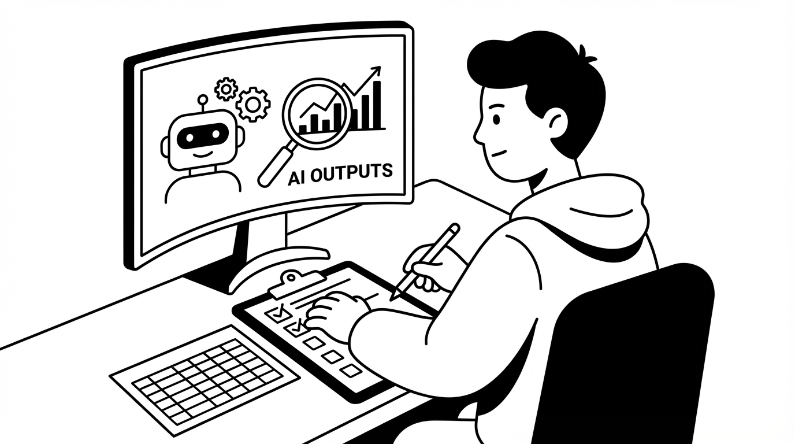
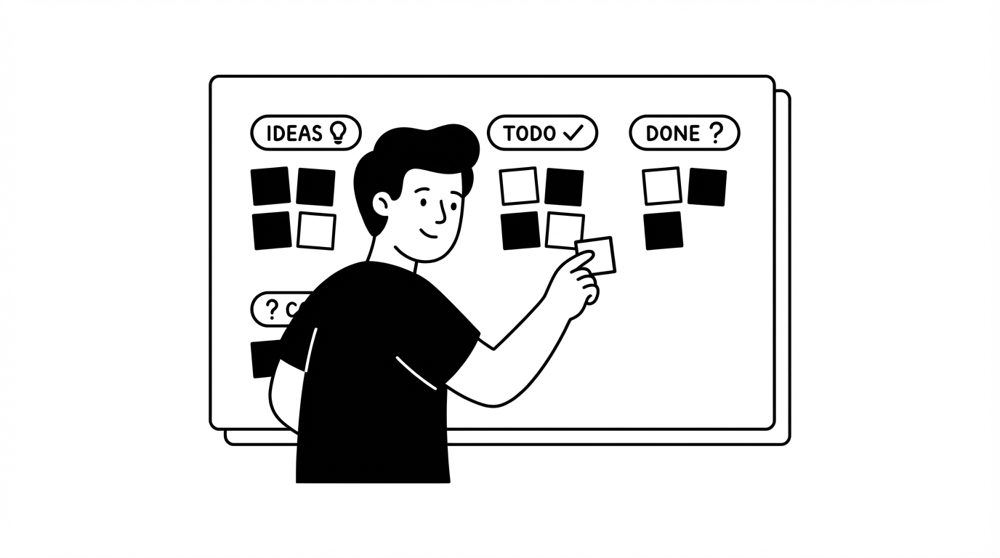

# AI 에이전트, "감"으로 고치고 계신가요? - 비개발자를 위한 AI 에이전트 평가/개선 가이드



"AI 에이전트가 잘 되는 것 같긴 한데... 정말 이게 최선일까?"

Claude Code나 Codex로 자동화 워크플로우를 운영하다 보면 이런 생각이 듭니다. 문제가 보이면 그때그때 고치고, 안 보이면 그냥 넘어갑니다. 저도 그랬습니다.

하지만 이 방식에는 한계가 있습니다:

- 눈에 띄는 문제만 고치게 됨
- 같은 문제가 반복되는지 알 수 없음
- "전체적으로 얼마나 좋아졌는지" 측정이 불가능

AI 평가 전문가들의 방법론을 공부하면서 깨달았습니다. **"감"이 아닌 "데이터"로 개선하는 체계적인 방법이 있다는 것을.** 코딩 없이, 비개발자도 할 수 있습니다.

이 글에서는 에러 분석부터 자동 품질 검증까지, AI 에이전트를 체계적으로 평가하고 개선하는 전체 프로세스를 단계별로 정리합니다.

---

## AI 에이전트 평가(AI Eval)란?

AI 에이전트 평가는 **AI 시스템이 제대로 작동하는지 체계적으로 검증하고 개선하는 과정**입니다.

> "I consider AI evals the number one most important new skill for product managers."
> — Hamel Hussein

데모에서는 잘 작동하던 AI가 실제 업무에서는 이상한 결과를 내놓는 경험, 해보셨나요? 데모 수준과 실무 품질 사이에는 큰 간극이 있습니다. 그 간극을 메우는 것이 바로 체계적인 평가입니다.

"Claude Code는 평가 없이도 잘 작동하던데요?"라고 생각하실 수 있습니다. 사실 Claude Code 같은 코딩 에이전트는 모델 훈련 과정에서 이미 테스트가 완료되어 있습니다. 하지만 **우리가 만든 자동화 워크플로우**는 다릅니다. 우리 비즈니스의 맥락, 우리만의 규칙이 반영되어야 하기 때문입니다.

실무에서 실제로 돌아가는 AI 에이전트를 운영한다면, 체계적인 평가는 선택이 아닌 필수입니다.

---

## 에러 분석 - 가장 건너뛰기 쉽지만 가장 강력한 단계


### AI에게 "이거 잘 됐어?" 물어보면 안 되는 이유

에이전트가 만든 결과물을 LLM에 보여주고 "이거 잘 된 거야?"라고 물어보고 싶은 유혹이 있습니다. 편하니까요.

하지만 이 방식은 **중요한 뉘앙스를 놓칩니다.**

실제 사례를 보겠습니다. 어떤 부동산 임대 챗봇이 있었습니다:

- 문자 메시지로 마크다운 형식을 보냄 (`**굵은글씨**`가 그대로 노출)
- "가상 투어 예약해줘"라는 요청에 일반 투어를 예약함 (가상 투어 기능이 없는데!)
- "내일로 변경해줘"에 기존 예약은 그대로 두고 새 예약을 추가함 (이중 예약!)

이 문제들을 ChatGPT에게 보여주면? **"적절하게 응답했습니다"**라고 말할 가능성이 높습니다.

왜냐하면 ChatGPT는 이런 것을 모르기 때문입니다:

- "우리 서비스에는 가상 투어가 없다"
- "문자 메시지에 마크다운 쓰면 안 된다"
- "예약 변경은 기존 예약을 취소해야 한다"

이런 건 **도메인 전문가인 "나"만 알 수 있는 것들**입니다.

### 100개만 직접 보면 시스템 전문가가 된다

"직접 다 봐야 한다고? 그게 가능해?"

생각보다 빠릅니다. 숙련되면 **하나의 결과물을 30초 안에 스캔**할 수 있습니다. 100개면 약 50분. 하루 30분씩 이틀이면 끝납니다.

> "Error analysis is the step that most people skip in Evals and it's rarely talked about and it's the thing that's going to give you extreme leverage."

핵심 팁은 **완벽하지 않아도 된다**는 것입니다. 원인 분석은 나중 문제입니다. 지금은 "어? 이상한데?"를 발견하고 메모만 하면 됩니다.

> "Just journal, observe freely. Don't try to get into root cause analysis."

---

## 에러 분류와 우선순위 결정 - Spreadsheet의 힘



### 자유롭게 메모하고, 비슷한 것끼리 묶기

50~100개 정도 검토하면 메모가 쌓입니다. 이제 **비슷한 문제끼리 묶습니다**.

예를 들어:

- "요약이 너무 길다", "불필요한 내용이 많다" → **길이/간결성 문제**
- "핵심이 빠졌다", "중요한 단계 누락" → **핵심 내용 누락**
- "형식이 깨졌다", "마크다운 오류" → **형식 오류**

이 분류 작업에 AI를 활용할 수 있습니다. LLM에게 메모 목록을 주고 "5~6개 카테고리로 분류해줘"라고 요청하면 초안을 만들어줍니다.

**단, AI가 만든 분류를 그대로 쓰지 마세요!**

- "품질 문제" ← 너무 넓음. 뭘 어떻게 고치라는 건지 모름
- "길이 초과" ← 구체적. "요약을 짧게 하라"는 액션이 나옴

카테고리는 **"다른 사람이 봐도 같은 판단을 할 수 있을 정도로"** 구체적이어야 합니다.

그리고 반드시 **'기타' 옵션을 추가**하세요. 이 옵션에 분류되는 것들이 많으면, 놓친 카테고리가 있다는 신호입니다.

### Pivot Table로 우선순위 결정

분류가 끝나면 **어떤 문제가 가장 자주 발생하는지 셉니다.**

Google Sheets의 피벗 테이블을 쓰면 쉽습니다:

| 문제 카테고리    | 발생 횟수 |
| ---------------- | --------- |
| 길이/간결성 문제 | 23회      |
| 핵심 내용 누락   | 15회      |
| 형식 오류        | 8회       |

이제 명확합니다: **"길이/간결성 문제"를 먼저 해결하면 가장 큰 개선 효과**를 볼 수 있습니다.

고급 AI 모니터링 도구가 없어도 됩니다. **Spreadsheet와 Pivot Table만으로 충분히 강력한 평가가 가능합니다.**

---

## LLM Judge - AI가 품질을 자동으로 검증하게 만들기

에러 분류가 끝나고 가장 빈번한 문제를 파악했다면, 이제 **자동으로 품질을 검증하는 시스템**을 만들 수 있습니다. 이것이 **LLM Judge**입니다.

### LLM Judge가 뭔가요?

쉽게 말해, **AI에게 "이 결과물이 기준에 맞는지 판단해줘"라고 시키는 것**입니다.

예를 들어, YouTube 요약 에이전트가 있다면:

- 사람이 매번 결과물을 일일이 검토하는 대신
- Claude에게 "이 요약이 기준에 맞으면 Pass, 안 맞으면 Fail이라고 판단해줘"라고 프롬프트를 주면
- Claude가 자동으로 Pass/Fail을 판정해줍니다

**왜 Pass/Fail인가요?**

체크리스트를 만들 때 흔히 하는 실수가 있습니다: **1~5점 척도로 평가하려는 것**.

"요약 품질: 4점", "정확성: 3점"... 이렇게 하면:

- 사람마다 기준이 다름 (내 4점이 다른 사람의 3점)
- AI도 숫자 척도를 일관되게 못 씀
- "그래서 고쳐야 해 말아야 해?"가 불분명

> "Focus on a binary decision - it's easier to align and ultimately your business decisions are yes or no decisions."

**그냥 Pass/Fail로 판단하는 게 훨씬 명확합니다.**

### LLM Judge 만드는 법 - 구체적인 예시

**1단계: 검증할 기준을 정한다**

앞서 에러 분류에서 "길이/간결성 문제"가 가장 많았다면, 이걸 기준으로 삼습니다.

**2단계: 기준을 명확한 질문으로 바꾼다**

- ❌ 모호함: "요약이 적절한 길이인가?"
- ✅ 명확함: "요약이 원본 영상 길이의 20% 이하인가?"

**3단계: 프롬프트를 작성한다**

실제로 사용할 수 있는 프롬프트 예시입니다:

```
당신은 YouTube 요약 품질을 검증하는 심사관입니다.

[원본 영상 정보]
- 제목: {video_title}
- 길이: {video_length}분

[생성된 요약]
{summary_text}

## 판정 기준
1. 요약 길이가 원본 영상 1분당 2문장 이하인가?
2. 영상의 핵심 주제가 요약에 포함되어 있는가?

## 판정 방법
- 두 기준을 모두 충족하면 → PASS
- 하나라도 충족하지 못하면 → FAIL

아래 형식으로만 답하세요:
판정: [PASS 또는 FAIL]
이유: [한 문장으로 판정 이유]
```

**4단계: 테스트하고 개선한다**

1. 이미 검토한 결과물 20~30개를 가져옵니다
2. 내가 직접 Pass/Fail을 판정해둡니다
3. LLM Judge에게도 똑같이 판정하게 합니다
4. 내 판정과 AI 판정을 비교합니다
5. 틀린 케이스를 보고 프롬프트를 수정합니다

예를 들어, AI가 너무 관대하게 Pass를 준다면 기준을 더 엄격하게 수정합니다.

### LLM Judge 활용 예시

| 검증 대상   | 판정 기준 예시                          |
| ----------- | --------------------------------------- |
| 요약 품질   | "핵심 주제 3개가 모두 포함되어 있는가?" |
| 답변 정확성 | "사실과 다른 내용이 있는가?"            |
| 형식 준수   | "마크다운 문법 오류가 있는가?"          |
| 톤/스타일   | "비격식적 표현이 포함되어 있는가?"      |

한 번에 여러 기준을 검증하지 말고, **하나의 기준당 하나의 Judge**를 만드는 게 정확도가 높습니다.

---

## 실전: Claude Code 워크플로우에 적용하기

지금까지 배운 것을 실제 자동화 파이프라인에 어떻게 적용할까요?

### 4단계 적용 프로세스

**Step 1: 결과물 모으기**

- 에이전트의 입력과 출력을 파일로 저장
- 복잡한 도구 필요 없음. 폴더에 파일이 쌓이기만 해도 충분

**Step 2: 100개 스캔하며 메모하기**

- 30초 내로 각 결과물을 훑으며 이상한 점 메모
- 원인 분석하지 말고 관찰에 집중
- Google Sheet에 자유롭게 기록

**Step 3: 분류하고 우선순위 정하기**

- 메모를 5~6개 카테고리로 분류
- Pivot Table로 어떤 문제가 가장 많은지 카운팅
- 가장 빈번한 문제를 개선 1순위로 선정

**Step 4: 자동 품질 검증 만들기**

- 1순위 문제에 대해 Pass/Fail 기준 정의
- LLM Judge 프롬프트 작성
- 20~30개 샘플로 테스트 후 프롬프트 개선
- 이후 새로운 결과물은 자동으로 품질 체크

**핵심**: 도구에 의존하지 말고 **프로세스에 집중**하세요. 고급 AI 모니터링 플랫폼이 없어도 CSV 파일과 Spreadsheet만으로 충분히 시작할 수 있습니다.

---

## 마치며

AI 에이전트 평가의 핵심을 정리하면 이렇습니다:

1. **에러 분석이 시작점** - AI에게 맡기면 도메인 뉘앙스를 놓친다
2. **분류와 카운팅** - "감"이 아닌 "데이터"로 우선순위 결정
3. **LLM Judge** - 반복되는 품질 검증을 자동화

| 기존 방식            | 체계적 평가                    |
| -------------------- | ------------------------------ |
| 문제 보이면 그때그때 | 패턴 발견 후 우선순위 결정     |
| AI에게 "잘 됐어?"    | 도메인 전문가인 내가 직접 판단 |
| 개선 효과 측정 불가  | Pass율로 정량 측정             |

**100개의 결과물을 직접 본 사람만큼 그 시스템을 잘 아는 사람은 없습니다.**

에이전트 결과물 20개만 모아서 직접 스캔해보세요. 그것만으로도 완전히 다른 시각이 열립니다.

---

*이 글은 Hamel Hussein & Shreya Shankar의 "How to Build AI Evals in 2026" 영상을 기반으로 정리했습니다.*

*원본 영상: https://www.youtube.com/watch?v=J7N9FMouSKg*
