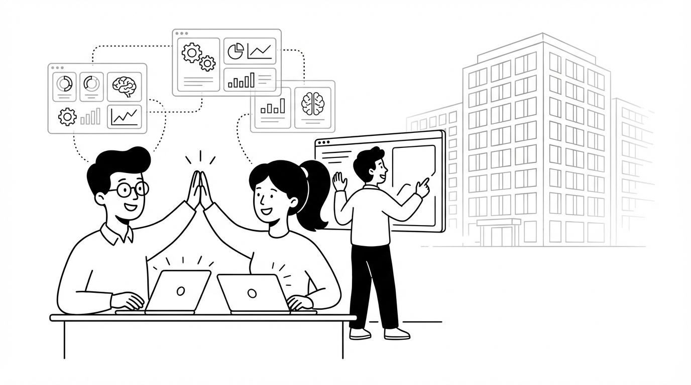
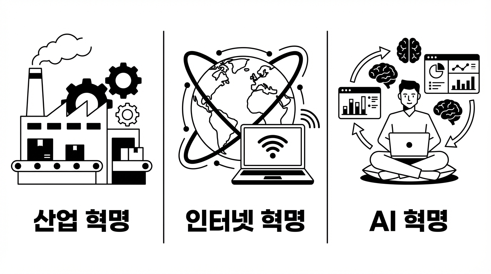
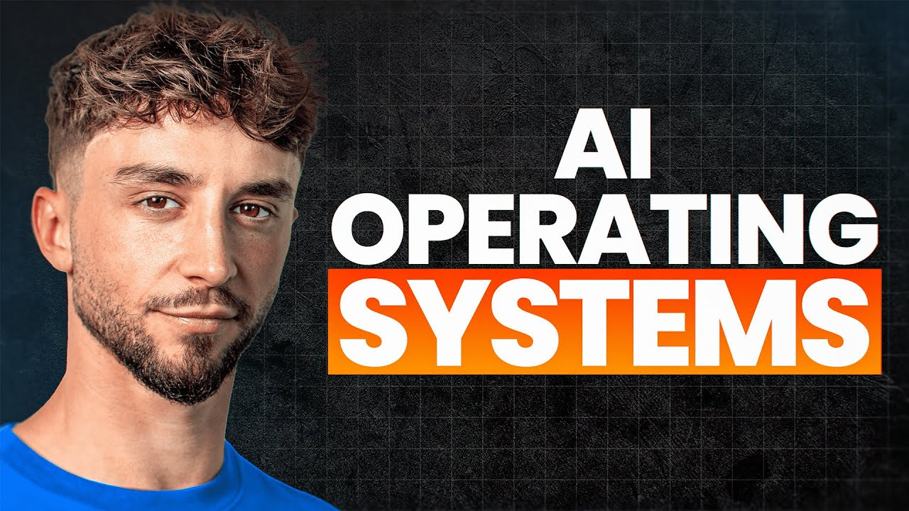
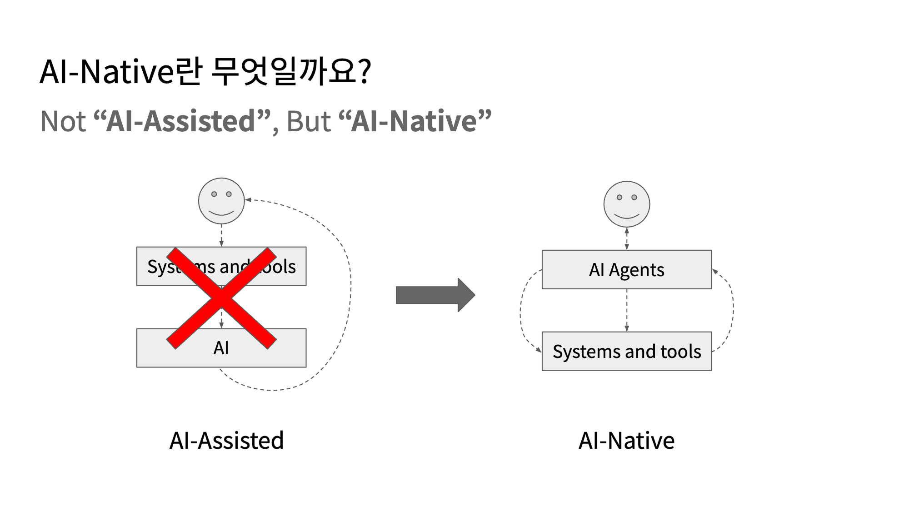
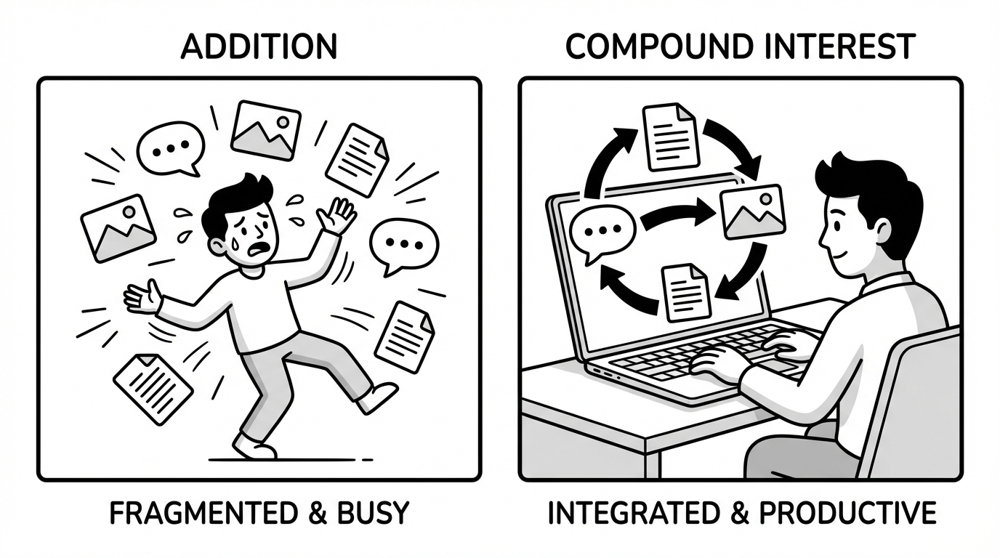

# AI Native 조직이 온다 - AI는 조직과 일하는 방식을 어떻게 바꾸고 있는가?



송길영 작가는 『시대예보: 경량문명의 탄생』에서 이렇게 선언합니다.

> "앞으로는 2만 명이 필요한 피라미드를 열 명으로 만들 수 있다."

이 말이 현실이 되고 있습니다. 텔레그램은 30명이 운영하고, 미드저니는 40명이 이끕니다. 1인 브랜딩 에이전시가 1주일에 70개의 브랜드 컨셉을 만들어내고, 한 사람이 7일 만에 웨비나를 기획해서 100만 달러의 매출을 올립니다.

**AI가 조직의 크기와 일하는 방식을 근본적으로 바꾸는 전환이 시작됐습니다.**

산업혁명 이후 200년간 이어진 '중량 문명' — 거대 조직, 다층 위계, 대규모 자본이 곧 경쟁력이던 시대 — 이 끝나고 있습니다. 송길영 작가의 표현대로, 거대함이 곧 안전이던 '대마불사(大馬不死)'의 공식이 깨지고 **'대마필사(大馬必死)'**의 시대가 열리고 있어요. AI라는 '증강 수트'를 입은 소규모 조직이 기존의 대규모 팀을 압도하는 일이 벌어지고 있습니다.

지금 우리는 비즈니스 역사에서 세 번째 대전환의 한가운데 서 있습니다.

---

## 세 번째 대전환: 만드는 방식, 도달하는 방식, 그리고 운영하는 방식

비즈니스 역사에서 '운영 방식' 자체를 바꾼 기술 전환은 세 번뿐입니다.



**첫 번째는 산업혁명**이었습니다. 기계와 조립 라인이 등장하면서 수공업이 대량 생산으로 바뀌었죠. 비즈니스가 **'만드는 방식(Making)'**을 근본적으로 바꾼 순간입니다.

**두 번째는 인터넷**이었습니다. 갑자기 전 세계 누구에게나 즉시 도달할 수 있게 됐습니다. 침실에서 글로벌 기업을 만드는 게 가능해졌죠. **'도달하는 방식(Reaching)'**이 바뀐 겁니다.

**세 번째가 지금, AI입니다.** 이번에 바뀌는 건 만드는 것도, 도달하는 것도 아닙니다. **'운영하는 방식(Running)'** 자체가 바뀌고 있습니다.

기억나시나요? 인터넷 초기에 "온라인으로 물건을 사는 사람은 없을 것이다"라는 말이 있었습니다. 지금 "AI는 아직 실무에 쓰기엔 부족하다"는 말이 정확히 그때와 같은 위치에 있습니다. 이미 무너지고 있는 논리예요.

---

## AI Native 조직은 이미 여기에 있다

이게 먼 미래 이야기라고 생각하실 수 있습니다. 하지만 지금 이 순간, 서로 다른 영역에서 AI를 '운영 체제'로 쓰는 소규모 조직들이 이미 등장했습니다. 세 가지 사례를 구체적으로 보여드릴게요.

### 사례 1. Liam Ottley — 4개 비즈니스를 AI로 동시 운영


*출처: Liam Ottley, "[The Biggest Shift in Business Since the Internet Just Happened](https://www.youtube.com/watch?v=oC1h922cDoY)" (YouTube)*

뉴질랜드의 Liam Ottley는 AI 컨설팅 에이전시, 미디어 회사, 교육 사업, SaaS 제품까지 4개 비즈니스를 동시에 운영합니다. 비결은 Claude Code라는 AI 코딩 도구를 기반으로 만든 **'AI 운영 체제'**입니다.

그가 만든 시스템은 이렇게 작동합니다:

- **매일 아침 8시 전**, 텔레그램으로 전체 비즈니스 브리핑이 옵니다. 4개 회사의 매출 변화, 팀 업데이트, 어제 회의 요약, 콘텐츠 퍼포먼스, 기회와 위협 분석까지. 미팅 하나 없이 전체 현황을 파악합니다.
- 7~8개 대시보드에 흩어져 있던 데이터가 **하나의 화면**으로 통합됩니다. "날씨 앱 보듯이 비즈니스 건강을 체크한다"는 게 그의 표현입니다.
- 반복 업무를 하나씩 자동화하면서 **영구적으로 시간을 되샀습니다**. 예를 들어, 에이전시의 제안서 작성은 원래 수시간이 걸리던 작업인데, 이제 AI가 고객 미팅 녹취록을 분석해서 자동으로 제안서 슬라이드를 만들어줍니다.

결과는요? **7일 만에 웨비나를 기획하고, 유튜브 영상 5개를 제작하고, 이메일·퍼널·결제 시스템을 구축하고, 100만 뉴질랜드 달러의 매출을 만들었습니다.** 혼자서요. 보통이라면 팀이 한두 분기에 걸쳐 할 작업입니다.

### 사례 2. 일잘러 장피엠 — 업무 전체를 Claude Code 프로젝트로 구조화

저도 비슷한 방식으로 일하고 있습니다. AI 교육과 컨설팅을 하는 저의 업무 환경은 이렇게 생겼어요:

```
WorkOS/
├── learning-blog-writing/      ← 학습 → 블로그 자동 파이프라인
├── corporate-training/         ← 기업교육 실습 패키지 자동 생성
├── lecture-slide/              ← 강의 슬라이드 자동 제작
├── lecture-video/              ← 강의 영상 자동 생성
├── youtube-analysis/           ← 경쟁 채널 분석 자동화
├── linkedin-analysis/          ← 링크드인 일일 브리핑
├── b2b-email-inbound-sales/    ← 문의 메일 자동 분류
└── skills/                     ← 100개+ 재사용 AI Skills
```

**WorkOS 폴더 자체가 AI 운영 체제**입니다. 각 업무 영역이 하나의 Claude Code 프로젝트로 구성되어 있고, 각 프로젝트 안에 AI 에이전트, 스킬, 워크플로우가 독립적으로 작동합니다. 예를 들어:

- `learning-blog-writing`: YouTube 영상 URL 하나를 넣으면, 자막 추출 → 요약 → 개인 맞춤 질문 생성 → 심층 분석 → 아카이브 → 블로그 글 작성 → SEO 최적화 → Google Drive 업로드까지 자동으로 진행됩니다.
- `corporate-training`: 기업명과 직무를 입력하면 6개 AI 에이전트가 순차적으로 실행되어 맞춤형 AI 실습 패키지 11개를 자동 생성합니다. KB손해보험, 신한은행, SK하이닉스, 삼성전자 등 실제 고객사에 적용하고 있어요.
- `linkedin-analysis`: 매일 아침 주요 링크드인 계정의 포스트를 자동 수집하고, 한국어로 요약한 뒤, 저한테 중요한 인사이트를 담은 이메일 브리핑을 보내줍니다.

혼자 일하지만, **10개의 AI 프로젝트가 각각 팀원처럼 작동**합니다.

### 사례 3. BRND 김서진 — 100개 AI 에이전트로 운영하는 브랜딩 에이전시


*출처: [조쉬의 뉴스레터](https://maily.so/josh/posts/3jrk3ny6z51)*

전직 AI 프로덕트 엔지니어 출신인 김서진 대표는 BRND라는 1인 브랜딩 에이전시를 운영합니다. 그의 시스템에는 **약 100개의 AI 에이전트**가 있고, 7개의 '오케스트레이터(팀장 역할)'가 이들을 관리합니다.

기존 브랜딩 에이전시라면 1주일에 컨셉 1~2개를 내는 게 보통입니다. 김서진 대표는 **이틀 만에 30개 컨셉을 뽑고, 1주일 동안 약 70개 컨셉을 제시**합니다. 클라이언트 미팅 중에 "이런 느낌으로요"라는 말이 나오면, 그 자리에서 **50개의 일러스트 베리에이션을 실시간으로 생성**합니다.

그가 강조하는 핵심 구분이 있습니다:

- **AI Assisted(보조적 활용)**: "배경색을 파란색으로 바꿔줘" — 사람이 '어떻게(How)'를 지시
- **AI Native(근본적 활용)**: "따뜻한 느낌의 브랜드 시스템을 만들어줘" — 사람이 '무엇(What)'만 설명

그리고 이렇게 말합니다:

> "결과물을 직접 손보느냐, 결과물을 만드는 시스템을 손보느냐. 후자가 확장성이 훨씬 높다. 한번 시스템을 고치면, 이후 모든 결과물이 좋아진다."

---

## 도구를 쓰는 것 vs 시스템으로 운영하는 것



세 사례의 공통점이 보이시나요? **모두 AI를 개별 도구로 쓰는 게 아니라, 업무 전체를 관통하는 시스템으로 구축했다**는 점입니다.

이 차이는 생각보다 큽니다.

AI를 개별 도구로 쓰면 **덧셈**입니다. ChatGPT로 메일을 쓰면 30분이 절약됩니다. 이미지 AI로 썸네일을 만들면 1시간이 절약되죠. 좋습니다. 하지만 매일매일 같은 절약이 반복될 뿐, 쌓이지 않습니다.

AI를 통합 시스템으로 구축하면 **복리**입니다. 하나의 업무를 자동화하면 시간이 생기고, 그 시간으로 또 다른 업무를 자동화합니다.

> "자동화에 감싼 모든 업무는 다시는 잃지 않을 시간이다. 이게 복리로 불어난다."

단편적인 AI 팁이나 프롬프트 해킹이 효과가 없는 이유도 여기에 있습니다. **그걸 추가할 통합 시스템이 없으니까요.** 아무리 좋은 투자 팁을 들어도, 계좌가 없으면 복리가 쌓일 수 없는 것과 같습니다.

그렇다면 AI를 '시스템으로 운영한다'는 게 구체적으로 뭘까요? 위 세 사례의 공통 도구에 답이 있습니다. 바로 **Claude Code 같은 코딩 에이전트로 내 업무를 자동화하고 조직화하는 것**입니다. Claude Code, OpenAI Codex 등의 코딩 에이전트는 이제 개발자만의 도구가 아닙니다. **모든 직장인이 자신의 업무를 시스템으로 설계하고 자동화할 수 있는 범용 도구**로 자리잡고 있으며, AI를 시스템적으로 운영하는 가장 인기 있고 보편적인 솔루션이 되고 있습니다.

비개발자가 Claude Code로 실제 업무를 어떻게 자동화하는지 궁금하시다면, 일잘러 장피엠의 영상 [&#34;비개발자의 Claude Code 업무 활용법&#34;](https://youtu.be/C6xlOsQFyOQ?si=X8ifRU2JQrfDJv05)을 추천드립니다. 코딩 경험 없이도 업무 전체를 AI 시스템으로 구축하는 과정을 구체적으로 보여줍니다.

https://youtu.be/C6xlOsQFyOQ?si=X8ifRU2JQrfDJv05 (영상 삽입)

---

## 우리 조직은 어떻게 시작할까?

"그래, 좋은 얘기다. 근데 우리 팀은 어떻게 시작하지?"

거창하게 시작할 필요 없습니다. 세 가지만 해보세요.

**첫째, 반복 업무를 모두 적어보세요.** 매일 하는 리포팅, 체크인, 데이터 입력, 콘텐츠 기획, 팔로업 이메일... 빠짐없이 적습니다. 그리고 각각에 대해 "AI가 할 수 있는가?"를 Yes / Partially / No로 분류해보세요. Yes가 생각보다 많을 겁니다.

**둘째, 결과물이 아니라 시스템을 손보세요.** 보고서 하나를 AI로 쓰는 것보다, 보고서를 만드는 프로세스를 AI 시스템으로 구축하는 게 낫습니다. 한번 만들면 다음부터는 자동이니까요. 김서진 대표의 말처럼, "시스템을 고치면 이후 모든 결과물이 좋아집니다."

**셋째, AI가 할 일과 사람이 할 일을 구분하세요.** 모든 업무를 AI에 맡기려는 게 아닙니다. AI가 잘하는 것(대량 생성, 분석, 반복 실행)과 사람이 해야 하는 것(판단, 전략, 소통)을 명확히 나누는 겁니다. 이 구분만 해도 놀라울 정도로 일하는 방식이 달라집니다.

송길영 작가가 제시한 경량 문명의 원칙이 딱 들어맞습니다:

- **"우리는 지금 만납니다"** — 긴 온보딩 없이, 바로 일을 시작할 수 있어야 합니다. AI 시스템은 항상 컨텍스트를 기억하고 있으니까요.
- **"우리는 잠시 만납니다"** — 프로젝트 단위로 집중합니다. AI 에이전트도 필요할 때 호출하고, 끝나면 대기합니다.
- **"우리는 다시 만납니다"** — 한번 만든 시스템은 영구적으로 재사용됩니다.

---

## 마치며

정리하겠습니다.

**1.** 지금은 산업혁명, 인터넷에 이은 세 번째 대전환의 변곡점입니다. 바뀌는 것은 '운영하는 방식' 자체입니다.

**2.** AI Native 소규모 조직이 이미 등장했습니다. Liam Ottley는 7일 만에 팀 한두 분기 분의 일을 혼자 해냈고, 김서진 대표는 1주일에 70개 브랜딩 컨셉을 만듭니다.

**3.** 핵심은 AI를 개별 도구로 쓰는 것이 아니라, 통합 시스템으로 구축하는 것입니다. 개별 도구는 덧셈이지만, 시스템은 복리입니다.

**4.** 시작은 간단합니다. 반복 업무를 적고, 시스템을 손보고, AI가 할 일과 사람이 할 일을 구분하세요.

송길영 작가의 말로 마무리할게요:

> "덜 소유하면서도 더 풍요롭게, 덜 의존하면서도 더 단단하게 연결되는 삶의 방식."

이것이 경량 문명의 본질이고, AI Native 조직이 향하는 방향입니다.

이번 주에 **반복 업무 3개만 적어보세요.** 그게 시작입니다.

---

*AI를 실무에 활용하는 구체적인 방법이 궁금하시다면, AI Ground 블로그를 구독해주세요.*
