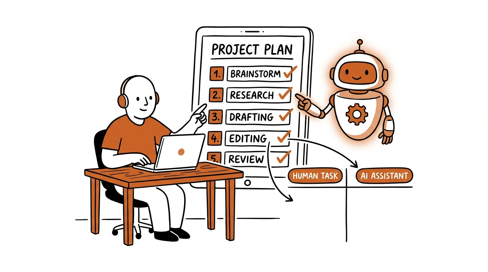

# AI에게 "시키지" 말고 "함께 설계"하세요 — 메타 프롬프팅으로 나만의 클로드 스킬 만들기



"AI 좋은 건 알겠는데, 막상 내 일에 어디다 써야 할지 모르겠어요."

혹시 당신도 이 지점에서 딱 막히지 않으셨나요? 유튜브에서 본 멋진 프롬프트를 복사해 붙여넣어 봐도, 내 업무에는 영 안 맞습니다. 그래서 결론을 내립니다. "내가 프롬프트를 못 써서 그런가 보다."

솔직히 말씀드릴게요. 문제는 프롬프트 실력이 아닙니다. **순서가 거꾸로 된 거예요.**

대부분의 사람은 "AI한테 뭘 시키지?"부터 고민합니다. 그런데 이건 두 번째로 해야 할 일을 첫 번째로 당겨버린 겁니다. 그래서 막힙니다. 진짜 필요한 건 '잘 시키는 법'이 아니라 **'AI와 함께 설계하는 법'**입니다. 저는 이걸 메타 프롬프팅이라고 부릅니다.

어렵게 들리시나요? 쉽게 말하면 이렇습니다. AI를 '답 주는 도구'가 아니라 '함께 일을 설계하는 동료'로 쓰는 것. 동료에게 일을 설명하듯 대화하면 됩니다. 그 대화에는 정해진 순서가 있어요. 쪼개기 → 구분하기 → 처리하기.

이 글은 그린코끼리 AI의 「클로드 AI 업무 자동화 3단계」 영상을 '메타 프롬프팅' 렌즈로 다시 풀어낸 것입니다. 같이 한 단계씩 가볼게요.

## 1단계 쪼개기 — 메타 프롬프팅으로 AI와 함께 업무 쪼개기

자동화의 80%는 사실 여기서 결정됩니다.

주간보고를 자동화한다고 해볼게요. 혼자 머릿속으로 쪼개면 보통 이렇게 끝납니다. "자료 모으고 → 보고서 쓰고 → 제출." 딱 3덩어리죠. 그런데 이 덩어리 안에서는 'AI에게 맡길 지점'이 안 보입니다. 너무 뭉뚱그려져 있거든요.

그래서 혼자 쪼개지 마세요. AI와 함께 쪼개세요. 이렇게 말을 걸면 됩니다.

```
이 주간보고 업무를 더 이상 못 쪼갤 때까지
아주 작은 행동 단위로, 순서대로 번호 매겨서 목록으로 만들어줘.
```

그러면 3덩어리였던 일이 무려 39단계로 펼쳐집니다. "캘린더를 열어 이번 주 일정을 훑는다 → 보고할 만한 회의를 메모한다 → 메일함을 연다..." 손이 가는 행동 하나하나까지요. 이렇게까지 잘게 나눠야 비로소 보이기 시작합니다. 이건 AI한테 맡겨도 되겠다, 이건 내가 꼭 해야겠다.

여기서 끝이 아닙니다. AI가 쪼갠 39단계에는 나와 상관없는 게 섞여 있어요. 안 쓰는 도구, 해당 없는 단계 같은 것들요. 그대로 받아 쓰면 안 됩니다. 한 번 더 대화하세요.

```
나는 슬랙은 안 쓰고, 노션 대신 엑셀을 써.
보고서에 매출 숫자는 안 들어가. 이 기준으로 다시 정리해줘.
```

그러면 39단계가 34단계로 다듬어집니다. 숫자가 중요한 게 아니에요. 핵심은 이게 **'나만의 업무 설계도'**가 된다는 겁니다. 요리를 자동화하려면 먼저 레시피를 단계별로 적어야 어디서 기계를 쓸지 보이잖아요. 그것과 똑같습니다.

## 2단계 구분하기 — AI 업무 자동화의 기준은 '판단과 책임'

이제 34단계를 사람 몫과 AI 몫으로 나눕니다. 기준은 딱 하나예요. **'판단과 책임'.**

고르고, 정하고, 책임지는 일. 이게 사람의 몫입니다. 나머지 수집하고, 정리하고, 초안 쓰는 일은 전부 AI에게 넘겨도 됩니다. 이것도 AI와 함께 나누면 됩니다.

```
이 34단계를 세 가지로 분류해줘.
① 내가 직접 / ② AI가 하고 나는 확인만 / ③ AI에 완전 위임
```

결과가 놀랍습니다. 34단계 중에 내가 진짜 머리 써야 할 일은 단 3개뿐이었어요.

1. 보고서에 무엇을 넣을지 고르기
2. 다음 주 계획 정하기
3. 최종 전송 버튼 누르기

나머지 31개는 전부 AI가 합니다. 여기서 한 가지 팁을 더 드릴게요. 판단은 스킬 '안'에 박지 마세요. 스킬은 수집·정리·초안 같은 순수 실행만 담당하게 하고, '내가 고르고 정하는' 판단은 흐름의 길목에 따로 두는 겁니다. 그래야 스킬이 깨끗한 부품으로 남아서 다른 업무에도 재사용할 수 있어요.

## 3단계 처리하기 — 대화를 '나만의 클로드 스킬'로 굳히기

설계가 끝났으면 이 흐름을 자산으로 만들 차례입니다.

```
이 워크플로우를 반복 실행할 수 있는 스킬로 만들어줘.
이름은 '주간보고 만들기'로 해줘.
```

여기에 커넥터(구글 캘린더, Gmail, 드라이브, 노션 등)를 연결하면 데이터 수집까지 자동으로 됩니다. 스킬을 실행하면 클로드가 알아서 일정·메일·기록을 모아 보고 초안을 만들어줍니다. 당신은 아까 그 판단 3개만 더하면 끝이에요.

**다만 한 가지는 꼭 기억하세요.** 스킬은 한 번 만들고 끝이 아닙니다. 처음부터 완벽하게 나오는 경우는 거의 없어요. 만들고 → 돌려보고 → 고치고. 원하는 결과가 나올 때까지 이 과정을 반복해야 합니다. 이 수정 과정도 결국 AI와의 대화예요. 초기에 시간을 한 번 제대로 투자하면, 그다음부터는 매주 판단 몇 개만 하면 됩니다.

결과물은 범용 도구가 아닙니다. **오직 나만을 위한 전용 비서 하나**가 생기는 거예요.

## 마치며

오늘 핵심을 세 줄로 정리할게요.

1. AI에게 "뭘 시킬까"부터 찾지 마세요. 업무를 AI와 함께 쪼개는 게 먼저입니다.
2. 사람은 판단만, 나머지는 전부 AI에게.
3. 대화로 설계한 흐름을 스킬로 굳히면, 나만의 비서가 됩니다.

거창한 프롬프트 엔지니어링이 아니에요. 동료에게 일을 설명하듯 대화하면 됩니다. 작은 스킬 하나가 매주 당신의 시간을 돌려줍니다.

> **오늘 바로 할 수 있는 4단계 액션**
>
> 1. **고르기** — 매주 반복하는 업무 1개를 고른다 (주간보고, 회의록 정리 등)
> 2. **쪼개기** — 클로드에게 "이 업무를 더 못 쪼갤 때까지 행동 단위로 나눠줘"라고 말 건다
> 3. **개인화** — "내가 안 쓰는 도구는 빼고 내 방식으로 다시 정리해줘"로 나만의 설계도 만들기
> 4. **구분하기** — "각 단계를 직접/확인만/완전위임으로 분류해줘"로 내 판단 지점 찾기

여기까지만 해봐도 "어디다 써야 할지 모르겠다"는 막막함이 "이건 맡기고 이건 내가 한다"는 명확함으로 바뀝니다. 스킬 제작과 커넥터 연결은 그다음 주말에 천천히 하셔도 늦지 않아요.

---
*이 글은 그린코끼리 AI의 「클로드 AI 업무 자동화 3단계」(https://youtu.be/hLNn4mDhR9c) 영상을 바탕으로, 필자가 '메타 프롬프팅' 관점에서 재해석해 작성했습니다.*
